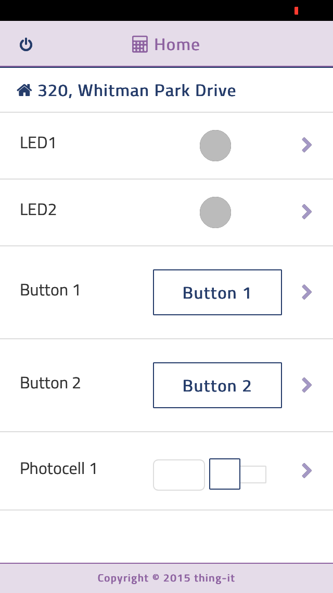
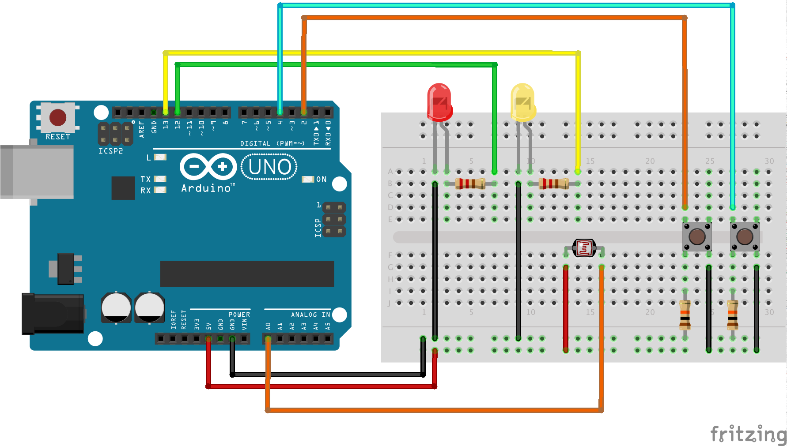
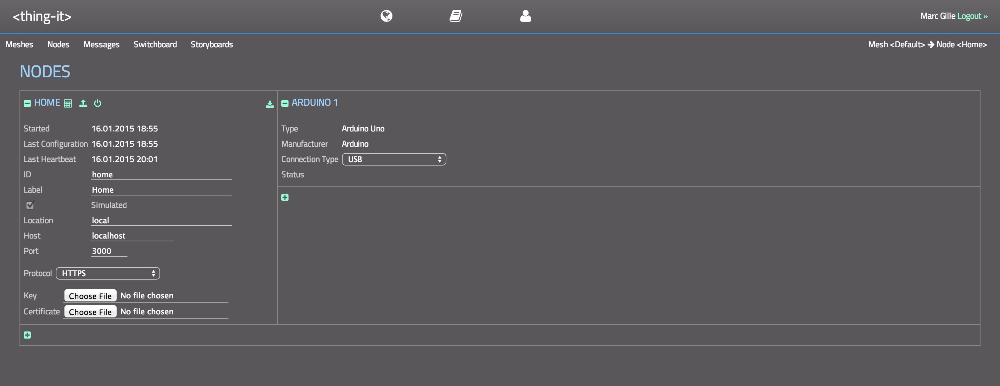
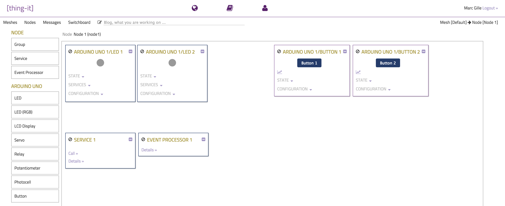
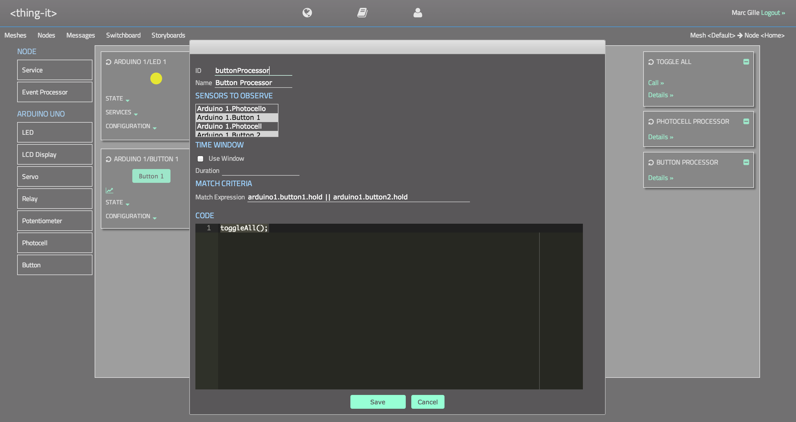

**[thing-it-node]** allows you to 

* connect multiple devices like an Arduino Uno or a Bluetooth-enabled Wristband to your node computer (e.g. a regular server, a Raspberry Pi or a BeagleBone Black) to centralize Internet access to a scalable set of Sensors and Actors connected to these devices, 
* invoke **REST Services** on all Actors, 
* receive **WebSocket Notifications** on all Sensor data changes and events,
* define **Higher-level REST Services** to control multiple Actors,
* define **Complex Event Processing** to react on Sensor events and data changes,
* use all of the above in a **Mobile Client** to control your devices.

All of the above is controlled by a [nodejs](http://nodejs.org/) server which is bootstrapped from a simple JSON configuration.

This allows you to configure e.g. **a home automation system in minutes**.

## Mobile Client

*[thing-it-node]* comes with a mobile client tested for iPhone, iPad and Android devices which allows you to control and monitor your devices.

[[ https://github.com/marcgille//thing-it-node/documentation/images/mobile-client.png | height = 400px ]]

## REST Services

You can invoke services of all Actors via
 
	jQuery.ajax({url : "https://yournode/devices/arduino1/actors/led1/services/on”, type : "POST"}).done(...).fail(...);

You also can define **Higher-level Services** on multiple Actors, e.g. to

* switch multiple LEDs on or off or close and open multiple Relays or
* create output on an LCD display and create a sound on a Piezo.

and also invoke those via REST, e.g.

	jQuery.ajax({url : "https://yournode/services/allLEDsOn”, type : "POST"}).done(...).fail(...);

## Web Socket Notifications

You can receive **WebSocket Notifications** on all Sensor data changes and events, e.g. via

	var socket = new io("https://yournode/node/4711/events");
	
	socket.on("event", function(event) {
		console.log(event.node);
		console.log(event.device);
		console.log(event.type);
		console.log(event.data);
	});

## Complex Event Processing

You can define **Complex Event Processing** on Sensor data changes and events like

    {
         "id": "eventProcessor3",
         "label": "Event Processor 3",
         "observables": ["arduino1.photocell1"],
         "window" : {"duration": 10000},
         "match" : "minimum(arduino1.photocell1.series) < 700 && deviation(arduino1.photocell1.series) < 100 && arduino1.photocell1.series.length > 1",
         "script": "arduino1.led1.on(); arduino1.led2.on();"
    }
to invoke the above Actor or Node Services, e.g.

* to produce LCD and Piezo output on simultaneous data changes on a motion detector, a thermo sensor and a sound detector for an alarm system or
* open the door if an RFID tag approaches an RFID receiver.

## Configuration File

The **[thing-it-node]** Configuration File contains definitions of Devices, Actors, Sensors, Services, Event Processors and groups of those in a simple JSON string, e.g.

    "actors": [
                {
                   "id": "led1",
                   "label": "LED1",
                   "type": "led",
                   "configuration": {
                      "pin": 12
                   }
                }, ...

You can use [www.thing-it.com](http://www.thing-it.com) to create and simulate your setup and then just download the configuration file.

# Dual License

**[thing-it-node]** is available under the [MIT License](./thing-it-node/license.mit) and the [Eclipse Public License](https://eclipse.org/org/documents/epl-v10.html).

# Philosophy

**[thing-it-node]** is created because we felt the need for a scalable management entity which bridges Internet services and multiple, possibly heterogenous devices. It is not intended to compete with, but rather complement and use great libraries and frameworks like

* [Fritzing](http://fritzing.org/) by FH Potsdam,
* [Johnny Five](https://github.com/rwaldron/johnny-five/wiki/Board) by Rick Waldron or
* [aREST](https://github.com/marcoschwartz/aREST) by Marco Schwarz.

# Getting Started

## The Scenario

Let's set up a simple - but not too simple - home automation scenario:

1. Two LEDs representing e.g. two lamps.
1. A Photocell to detect the ambient light in a room and event processing to switch both LEDs on if the light goes below some threshold for a while (to distinguish sunset from the Photocell being temporarily covered by your curious cat).
1. Two buttons to toggle the state of each lamp.
1. A simple (mobile capable) web application to toggle the state of both lamps individually and together - alternatively to using the buttons - and to display the event under 2.

## Installing, Configuring and Running [thing-it-node]

To install, configure and run  **thing-it-node**, first install

* **nodejs** and 
* **npm** 
 
on your computer (e.g. your Raspberry Pi). 

Then install **thing-it-node**:

`npm install thing-it-node`

in a directory _&lt;installDir&gt;_.

For our example above modify the options file **_&lt;installDir&gt;_/options.js** as follows

`nodeConfigurationFile : "<installDir>/examples/simple-lighting/configuration.json"`

so that the thing-it-node server will be booted against the Node configuration for our simple lighting scenario.

If you are interested, have a look at the [configuration file](./thing-it-node/examples/simple-lighting/configuration.json) - the content should be self-explanatory.

Probably the most interesting part is the definition of the Photocell 

    {
       "id": "photocell1",
       "label": "Photocell 1",
       "type": "photocell",
       "configuration": {
       "pin": "A0",
       "rate": 2000
       }
    }

and the Event Processing for the same

    {
       "id": "eventProcessor3",
       "label": "Event Processor 3",
       "observables": ["arduino1.photocell1"],
       "window" : {"duration": 10000},
       "match" : "minimum(arduino1.photocell1.series) < 700 && deviation(arduino1.photocell1.series) < 100 && arduino1.photocell1.series.length > 1",
       "script": "arduino1.led1.on(); arduino1.led2.on();"
    }

which ensures that the setup only reacts to a slow, consistent reduction of the ambient light.

Start the **thing-it-node** from _&lt;installDir&gt;_ via

`node thing-it-node.js`

You will see something like

    ---------------------------------------------------------------------------
     [thing-it-node] at http://0.0.0.0:3001

     Node Configuration File: /Users/marcgille/git/thing-it-node/thing-it-node/examples/simple-lighting/configuration.json
     Simulated              : true
     Hot Deployment         : false
     Verify Call Signature  : true
     Public Key File        : /Users/marcgille/git/thing-it-node/thing-it-node/examples/simple-lighting/cert.pem
     Signing Algorithm      : sha256

     Copyright (c) 2014-2015 Marc Gille. All rights reserved.
    -----------------------------------------------------------------------------

    Loading plugin [arduino].
    Starting Node [Home].
    Actor [LED1] started.
		    Actor [LED2] started.
		    Sensor [Button 1] started.
		    Sensor [Button 2] started.
		    Sensor [Photocell 1] started.
	    Device [Arduino Uno 1] started.
	    Event Processor [Event Processor 1] listening.
	    Event Processor [Event Processor 2] listening.
	    Event Processor [Event Processor 3] listening.
	    Service [toggleAll] available.
    Node [Home] started.  

which means that your **thing-it-node** server found its configuration and has been started properly. It is not doing anything because the option **simulated** is set to **true**. Stop the **[thing-it-node]** Server with **CTRL-C** and change its value to **false** to prepare [thing-it-node] to talk to the real device - which we still have to set up.

## Setting up Device, Actors and Sensors

To setup your Device you need the following hardware

* an Arduino Uno board (e.g. [http://www.adafruit.com/product/50](http://www.adafruit.com/product/50)),
* two LEDs (e.g. [https://www.sparkfun.com/products/9590](https://www.sparkfun.com/products/9590)),
* a Photocell (e.g. [http://www.adafruit.com/product/161](http://www.adafruit.com/product/161)),
* two buttons (e.g.),
* possibly a breadboard (e.g. [http://www.adafruit.com/product/64](http://www.adafruit.com/product/64)) and 
* possibly some jumper wires (e.g. [http://www.adafruit.com/product/758](http://www.adafruit.com/product/758)).

All of the above is also available with Arduino Starter Kits like

* the [Arduino Starter Kit](http://www.amazon.com/Arduino-Starter-Official-170-page-Projects/dp/B009UKZV0A/ref=sr_1_1?s=electronics&ie=UTF8&qid=1420481357&sr=1-1&keywords=arduino+starter+kit) or 
* the [Sparkfun Inventor's Kit]() or
* the [Fritzing Creator Kit](http://shop.fritzing.org/en/a-136/).

To get the Arduino Uno connected

* download and install the Arduino IDE
* plug in your Arduino or Arduino compatible microcontroller via USB,
* open the Arduino IDE, select: *File &raquo; Examples &raquo; Firmata &raquo; StandardFirmata*,
* click *Upload*.

If the upload was successful, the board is now prepared. Now,

* connect your Arduino Board via USB,
* connect the LEDs to Pin 12 and 13.
* connect the Buttons to Pin 2 and 4.
* connect the Photocell to Pin A0.

e.g. like

Restart the **thing-it-node** server. The output should now look like 

    ---------------------------------------------------------------------------
     [thing-it-node] at http://0.0.0.0:3001

     Node Configuration File: /Users/marcgille/git/thing-it-node/thing-it-node/examples/simple-lighting/configuration.json
     Simulated              : false
     Hot Deployment         : false
     Verify Call Signature  : true
     Public Key File        : /Users/marcgille/git/thing-it-node/thing-it-node/examples/simple-lighting/cert.pem
     Signing Algorithm      : sha256

     Copyright (c) 2014-2015 Marc Gille. All rights reserved.
    -----------------------------------------------------------------------------

    Loading plugin [arduino].
    Starting Node [Home].
    1422043614997 Device(s) /dev/cu.usbmodem1411 
    1422043618304 Connected /dev/cu.usbmodem1411 
    1422043618305 Repl Initialized 
    >> 	Starting Device [Arduino Uno 1]
 		    Actor [LED1] started.
		    Actor [LED2] started.
		    Sensor [Button 1] started.
		    Sensor [Button 2] started.
		    Sensor [Photocell 1] started.
	    Device [Arduino Uno 1] started.
	    Event Processor [Event Processor 1] listening.
	    Event Processor [Event Processor 2] listening.
	    Event Processor [Event Processor 3] listening.
	    Service [toggleAll] available.
    Node [Home] started.

You should also be able switch both LEDs on and off via the respective buttons or switch both LEDs on by covering the Photocell for more than a few seconds.

## Running the Mobile Web App

Connect your browser to 

`http://localhost:3001/mobile/console.html`

Browser content should look like

_(You can leave *Account* and *Password* empty for now. We will be adding security measures later.)_

If you have remote (e.g. Wifi) access to the computer running the **[thing-it-node]**, you may also use a mobile device (e.g. an iPhone or iPad) to connect to your simple lighting system.

## Summary

Let us recap what we did:

With

* a simple configuration file,
* the corresponding wiring of the Arduino 

but **no programming** we were able to create a simple but realistic home automation scenario.

## Using thing-it.com

If you still find the creation of the configuration file too technical - you may consider to use the free services of [www.thing-it.com](http://www.thing-it.com) to create and simulate your setup and then just download the configuration file.

On [www.thing-it.com](http://www.thing-it.com) you would define **Nodes** and **Devices**

put **Actors**, **Sensors**, **Services** and **Event Processors** together,

edit the logic of **Event Processors**

and **Services** and then simulate and test the configuration before you download it to your **[thing-it-node]** deployment.

Consider the [[thing-it] Documentation](http://www.thing-it.com/thing-it/index.html#/documentationPanel) to configure the scenario described above.

# Taking it further

If you have the **Getting Started** example running, you may want to

* understand the concepts of *thing-it* better
* have a look at further examples
* [connect your [thing-it-node] to the Internet](https://github.com/marcgille/thing-it-node/wiki/Connecting-%5Bthing-it-node%5D-to-the-Internet)
* [apply security measures for your [thing-it-node]](https://github.com/marcgille/thing-it-node/wiki/Using-Signature-and-Encryption-for-REST-Services-and-Web-Socket-Messages)
