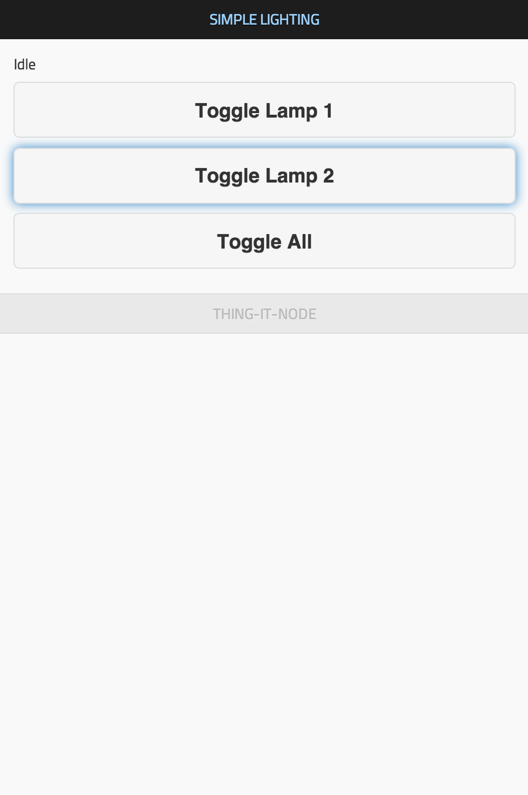

**thing-it-node** allows you to 
* connect multiple devices like an Arduino Uno or a Bluetooth-enabled Wristband to your computer (e.g. a Raspberry Pi) to centralize Internet access to a scalable set of Sensors and Actors connected to these devices,
* invoke REST services on all Actors,
* receive WebSocket notifications on all Sensor data changes and events,
* define higher-level services on multiple Actors and also invoke those via REST and
* define Complex Event Processing on Sensor data changes and events. 

All of the above is controlled by a **[nodejs](http://nodejs.org/)** server which is bootstrapped from a simple JSON configuration as opposed to a complex program.

This allows you to build e.g. a home automation system just with some minimal Web programming.

# Dual License

**thing-it-node** is available under the **[MIT License](./thing-it-node/license.mit)** and the **[Eclipse Public License](https://eclipse.org/org/documents/epl-v10.html)**.

# Philosophy

**thing-it-node** is created because we felt the need for a scalable management entity which bridges Internet services and multiple, possibly heterogenous devices. It is not intended to compete with, but rather complement and use great libraries and frameworks like

* **[Fritzing](http://fritzing.org/)** by FH Potsdam,
* **[Johnny Five](https://github.com/rwaldron/johnny-five/wiki/Board)** by Rick Waldron or
* aREST by Marco Schwarz.

# Getting Started

## The Scenario

Let's set up a simple - but not too simple - home automation scenario:

1. Two LEDs representing e.g. two lamps.
1. A Photocell to detect the ambient light in a room and event processing to switch on both lamps if the light goes below some threshold.
1. Two buttons to toggle the state of each lamp.
1. A simple (mobile capable) web application to toggle the state of both lamps individually and together - alternatively to using the buttons - and to display the event under 2.

## Installing, Configuring and Running thing-it-node

To install, configure and run  **thing-it-node**, first install

* **nodejs** and 
* **npm** 
 
on your computer (e.g. your Raspberry Pi). 

Then install **thing-it-node**:

`npm install thing-it-node`

in a directory _&lt;installDir&gt;_.

For our example above modify the file **_&lt;installDir&gt;_/configuration.js** as follows

`nodeConfigurationFile : "<installDir>/examples/simple-lighting/configuration.json"`

If you are interested, have a look at the [configuration file](./thing-it-node/examples/simple-lighting/configuration.json) - the content should be self-explanatory.

Start the **thing-it-node** from _&lt;installDir&gt;_ via

`node thing-it-node.js`

You will see something like

    ---------------------------------------------------------------------------
     thing-it Node at http://0.0.0.0:3001

     Copyright (c) 2014-2015 Marc Gille. All rights reserved.
    -----------------------------------------------------------------------------

    Loading plugin <arduino>.
    Starting Node <Home>.
     	Starting Controller <Arduino Uno 1>
		Actor <LED 1> started.
    Published message Cannot initialize arduino1/led1:TypeError: Cannot read property 'type' of null
		Actor <LED 2> started.
    Published message Cannot initialize arduino1/led1:TypeError: Cannot read property 'type' of null
		Sensor <Button 1> started.
    Published message Cannot initialize arduino1/button1:TypeError: Cannot read property 'type' of null
		Sensor <Button 2> started.
    Published message Cannot initialize arduino1/button2:TypeError: Cannot read property 'type' of null
	Controller <Arduino Uno 1> started.

which means that your **thing-it-node** server has started properly, found its configuration but determined that your Arduino Board is not wired up yet.

## Setting up Board, Actors and Sensors

To setup your board you need the following hardware

* an Arduino Uno board [http://www.adafruit.com/product/50](http://www.adafruit.com/product/50),
* two LEDs e.g. [https://www.sparkfun.com/products/9590](https://www.sparkfun.com/products/9590),
* a Photocell, e.g. [http://www.adafruit.com/product/161](http://www.adafruit.com/product/161),
* two buttons, e.g.
* possibly a breadboard (e.g. [http://www.adafruit.com/product/64](http://www.adafruit.com/product/64)) and 
* possibly some jumper wires [http://www.adafruit.com/product/758](http://www.adafruit.com/product/758)

all of the above is also available with Arduino Starter Kits like

* the [Arduino Starter Kit](http://www.amazon.com/Arduino-Starter-Official-170-page-Projects/dp/B009UKZV0A/ref=sr_1_1?s=electronics&ie=UTF8&qid=1420481357&sr=1-1&keywords=arduino+starter+kit) or 
* the [Sparkfun Inventor's Kit]() or
* the [Fritzing Creator Kit](http://shop.fritzing.org/en/a-136/).

To get the Arduino connected

* download and install the Arduino IDE
* plug in your Arduino or Arduino compatible microcontroller via USB,
* open the Arduino IDE, select: *File &raquo; Examples &raquo; Firmata &raquo; StandardFirmata*,
* click *Upload*.

If the upload was successful, the board is now prepared. Now,

* connect your Arduino Board via USB,
* connect the LEDs to Pin 12 and 13.
* connect the Buttons to Pin 2 and 4.
* connect the Photocell to Pin A0.

e.g. like

Restart the **thing-it-node** server. The output should now look like 

    ---------------------------------------------------------------------------
     thing-it Node at http://0.0.0.0:3001

     Copyright (c) 2014-2015 Marc Gille. All rights reserved.
    -----------------------------------------------------------------------------

    Loading plugin <arduino>.
    Starting Node <Home>.
     	Starting Device <Arduino Uno 1>
		Actor <LED 1> started.
		Actor <LED 2> started.
		Sensor <Button 1> started.
		Sensor <Button 2> started.
	Device <Arduino Uno 1> started.

You should also be able switch both LEDs on and off via the respective buttons or switch both LEDs on by covering the Photocell.

Finally, connect your browser to 

`http://localhost:3001/examples/simple-lighting/console.html`

Browser content should look like

If you have remote (e.g. Wifi) access to the computer running the **thing-it Server**, you may also use a mobile device (e.g. an iPhone or iPad) to connect to your simple lighting system.

Let us recap what we did:

With

* a simple configuration file,
* the corresponding wiring of the Arduino and 
* a very simple HTML file for mobile

but **no programming** we were able to create a simple but realistic home automation scenario.

If you still find the creation of the configuration file too technical - you may consider to use the free services of [www.thing-it.com](http://www.thing-it.com) to create and simulate your setup and then just download the configuration file.

On [www.thing-it.com](http://www.thing-it.com) you would define **Nodes** and **Devices**

put **Actors**, **Sensors**, **Services** and **Event Processors** together,

edit the logic of **Event Processors**

and **Services** and then simulate and test the configuration before you download it to your **thing-it-node** deployment.

Consider the [&lt;thing-it&gt; Documentation](http://www.thing-it.com/thing-it/index.html#/documentationPanel) to configure the scenario described above.

# Taking it further

If you have the **Getting Started** example running, you may want to

* understand the concepts of *thing-it* better
* have a look at further examples
