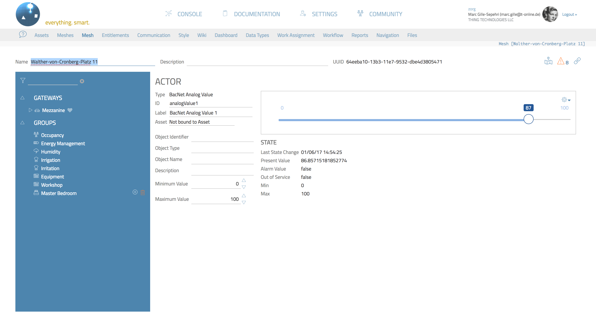

[](https://nodei.co/npm/thing-it-node/)
[](https://nodei.co/npm/thing-it-node/)

**[thing-it-node]** is **a scalable Operating System for Things** and allows you to

* connect multiple Devices (e.g. Heart Rate Monitors, Sensor Tags, Drones) as well as low-level Actors and Sensors managed via Microcontrollers like an Arduino
  to your Device Gateway computer (e.g. a regular server, a [Raspberry Pi Zero](https://github.com/marcgille/thing-it-node/wiki/Installation-Raspberry-Pi-Zero) or a BeagleBone Black)
* invoke **REST Services** on all Devices and Actors,
* receive **WebSocket Notifications** on all Device and Sensor state changes and events,
* define **Higher-level REST Services** to control multiple Actors,
* define **Complex Event Processing** to react to Sensor events and state changes,
* define **Storyboards** for the timeline-based invocation of Node, Device and Actor Services (e.g. for robotics),
* define **Job Schedules** for a calendar-based, recurring execution of Services including start of Storyboards,
* define **Complex Data Variables** to persistently store Event Data for later evaluation or for configurations
* manage **Users an their Entitlements** to access the above elements and
* use a **Mobile App** to monitor and control arbitrary Devices.

All of the above is controlled by a [nodejs](http://nodejs.org/) server which is bootstrapped from a **simple JSON configuration**, which allows you to
e.g. configure a **complex Device control in minutes**.

<p align="center"><a href="./documentation/images/architecture.png"></a></p>

More details can be found on the [thing-it-node Wiki](https://github.com/marcgille/thing-it-node/wiki).

# thing-it.com

You can use [www.thing-it.com](http://www.thing-it.com) to create and simulate your setup for **[thing-it-node]** and then just push the configuration file or
connect your Device Gateways safely to the Internet.

# Dual License

**[thing-it-node]** is available under the [MIT License](./thing-it-node/license.mit) and the [Eclipse Public License](https://eclipse.org/org/documents/epl-v10.html).

# Getting Started

## The Scenario

Let's set up a simple Smart Home scenario leveraging the easy-to-configure Z-Wave standard with

* an Ambient Light Sensor,
* a Light Bulb and
* a Switch for arbitrary powered Devices (e.g. your electrical rocking chair).

In our scenario we will

* discover all the above Z-Wave Devices automatically with **[thing-it-node]** after they are paired,
* expose toggle on Light Bulb and Switch with a simple service call - which you could invoke from the [thing-it] Mobile App or from your own Web App via REST,
* detect if the ambient light goes below a certain threshold for a longer timeframe - not if your cat strays past -, switch the light bulb on
and whatever you have connected to the switch.

**Not interested in Smart Home Experiments with Z-Wave?**

If you are not interested in tinkering with Z-Wave Devices and just intend to e.g. control your

* sound system,
* aquaponics ecosystem
* drones,

then maybe stop reading. Check what we have on **[github](https://www.github.com)**/**[npm](www.npmjs.com)** under

* [thing-it-device-sonos](https://www.npmjs.com/package/thing-it-device-sonos) to connect Sonos Entertainment systems,
* [thing-it-device-aircable](https://www.npmjs.com/package/thing-it-device-aircable) to connect Aircable Smart Dimmers,
* [thing-it-device-ar-drone](https://www.npmjs.com/package/thing-it-device-ar-drone) to control AR Drones,
* [thing-it-device-ti-sensortag](https://www.npmjs.com/package/thing-it-device-sensortag) to monitor Texas Instruments SensorTag devices,
* [thing-it-device-ti-art-net](https://www.npmjs.com/package/thing-it-device-art-net) to control lighting and more in an ArtNet/DMX network,
* [thing-it-device-itach](https://www.npmjs.com/package/thing-it-device-itach) to get access to IR-controlled devices (e.g. TVs, cleaning robots),
* [thing-it-device-philips-hue](https://www.npmjs.com/package/thing-it-device-philips-hue) to control lighting with Philips Hue,
* [thing-it-device-plugwise](https://www.npmjs.com/package/thing-it-device-plugwise) to control Plugwise switches, thermostats and sensors,
* [thing-it-device-foscam](https://www.npmjs.com/package/thing-it-device-foscam) to access Foscam cameras,
* [thing-it-device-atlas-scientific](https://www.npmjs.com/package/thing-it-device-atlas-scientific) to access Atlas Scientific probes e.g. for pH value measurement,
* and more every day ...

Or check the [thing-it.com Mesh Market](https://www.thing-it.com/thing-it/index.html#/marketPanel).

But wait! May be you want to switch on your Sonos if the Z-Wave Sensor detected motion, switch on your vents for you Aquaponics greenhouse if the
ambient temperature is above a certain threshold. Or the fish pond's water temperature. Or you want to have your drone flying over the fish pond while
your Sonos is playing "Girl from Ipanema", but only if the Foscam camera detects an intruder?

OK, keep reading ...

## Prerequisites

As Z-Wave communication is a standard component of [thing-it-node], you need to install **Open Z-Wave** on your Device Gateway Computer.

### Linux and OSX

For all Raspberry Pi/C.H.I.P/BeagleBone - and yes, OSX - users:

You will need to ensure the OpenZWave library and headers are installed first. You can do this one of two ways:

* Downloading the source tarball from the [OpenZWave repository](https://github.com/OpenZWave/open-zwave/releases) and then compiling it and installing on your system via **make** and **sudo make install**.
* You could also install OpenZWave via a precompiled package that's suitable for your Linux distribution and architecture. Notice: Be sure to install BOTH the binary (libopenzwave-x.y) AND the development package (libopenzwave-dev).

### Windows

Since there is no standard installation location for Open Z-Wave on Windows, it will be automatically downloaded, compiled, and installed when you install
**openzwave-shared** via **npm** (which we will be installing with [thing-it-node]).

## Installing, Configuring and Running [thing-it-node]

To install, configure and run  **[thing-it-node]**, first install [nodejs](https://nodejs.org/en/download/)
on your computer (e.g. your PC or your [Raspberry Pi Zero](https://github.com/marcgille/thing-it-node/wiki/Installation-Raspberry-Pi-Zero)). 

Then install **[thing-it-node]** via

```
npm -g install thing-it-node 
```

which will install **[thing-it-node]** in your global **/node_modules** directory and makes it available 
via the command line program **tin**.

Note, that depending on the access right settings on your file system you may need to invoke

```
sudo npm -g install thing-it-node 
```

instead.

Now create an arbitrary Installation Directory **_installDir_** and make it your current working directory, e.g.

```
mkdir ~/thing-it-test
cd ~/thing-it-test
```

Then invoke

```
tin example -f z-wave-empty
```

which will create a directory **_installDir_/configurations** and copy the sample **[thing-it-node]** Node Configuration
**z-wave-empty.js** into it from which **[thing-it-node]** can be booted.

If you are interested, have a look at this [Node Configuration File](./thing-it-node/examples/z-wave/z-wave-empty.json) - the content should be self-explanatory.

The most important part is

```javascript
autoDiscoveryDeviceTypes: [{
        plugin: "z-wave/zWaveNetwork",
        confirmRegistration: false,
        persistRegistration: true,
        defaultConfiguration: {},
        options: {}
    }]
```

which tells **[thing-it-node]** to auto-discover Z-Wave networks and add them (and their devices) to the Configuration permanently and without user confirmation.

Start the **[thing-it-node]** first via

```
tin run --simulate
```

You will see something like

    Running [thing-it-node] from Default Options.
      
    ---------------------------------------------------------------------------
     Protocol                     : http
     Port                         : 3001
     Node Configurations Directory: /Users/marcgille/git/thing-it-node/configurations
     Simulated                    : true
     Log Level                    : debug
    -----------------------------------------------------------------------------
    
    
    12/1/2015 6:32:01 AM INFO NodeManager ===> Scanning directory [/Users/marcgille/git/thing-it-node/lib/../node_modules] for Device Plugins: 		    Actor [LED1] started.
    ...
    12/1/2015 6:32:01 AM INFO Node[The Node] Event Processors started.
    12/1/2015 6:32:01 AM INFO Node[The Node] Jobs activated.
    12/1/2015 6:32:01 AM INFO Node[The Node] Node [The Node] started.

which means that your **[thing-it-node]** Server found its configuration and has been started properly. It is not doing anything because the option **simulated** is set to **true** in the default options. 
You could already use the **[thing-it-node]** Mobile Client against the simulated configuration (which you definitely would do on a new configuration), but for now we want the real thing.

Stop the **[thing-it-node]** Server with **CTRL-C** to prepare **[thing-it-node]** to talk to a real Device.

## Setting up Devices

You need to purchase a Z-Wave controller,
e.g. an [Aeotec Z-Stick](http://aeotec.com/z-wave-usb-stick).

Also purchase a few Z-Wave devices, e.g.

* an [Aeotec By Aeon Labs Gen5 Z-wave Plus 6-in-1 Multisensor 6 ZW100-A](http://www.amazon.com/Aeotec-Aeon-Labs-Z-wave-Multisensor/dp/B00WMEVRRW/ref=sr_1_cc_3?s=aps&ie=UTF8&qid=1455407667&sr=1-3-catcorr&keywords=z-wave+light+sensor),
* a [GoControl Z-Wave Dimmable LED Light Bulb] (http://www.amazon.com/GoControl-Z-Wave-Dimmable-Light-LB60Z-1/dp/B00PJH16UC),
* a [Aeon Labs DSC06106-ZWUS - Z-Wave Smart Energy Switch](http://www.amazon.com/Aeon-Labs-DSC06106-ZWUS-Z-Wave-Energy/dp/B007UZH7B8)

Pair these devices with you Z-Wave Controller in the above order by following the documentation which comes with the Controller. It usually involves
just clicking the pairing button close to the Device.

Restart the **thing-it-node** server with

```
tin run
```

The output should now look like 

    Running [thing-it-node] from Default Options.
      
    ---------------------------------------------------------------------------
     Protocol                     : http
     Port                         : 3001
     Node Configurations Directory: /Users/marcgille/git/thing-it-node/configurations
     Simulated                    : false
     Log Level                    : debug
    -----------------------------------------------------------------------------
    
    
    12/1/2015 6:32:01 AM INFO NodeManager ===> Scanning directory [/Users/marcgille/git/thing-it-node/lib/../node_modules] for Device Plugins: 		    Actor [LED1] started.
    ...
    12/1/2015 6:32:01 AM INFO Node[The Node] Event Processors started.
    12/1/2015 6:32:01 AM INFO Node[The Node] Jobs activated.
    12/1/2015 6:32:01 AM INFO Node[The Node] Node [The Node] started.

## Adding Services

Extend the **services** section with something like

```javascript
...
services: [{
                   id: "toggleAll",
                   label: "Toggle All",
                   type: "script",
                   content: {
                       script: "if ([node].zWaveNetwork.lightBulb.state.light == 'on') {[node].zWaveNetwork.lightBulb.off(); [node].zWaveNetwork.switch.off();} else {[node].zWaveNetwork.lightBulb.on(); [node].zWaveNetwork.switch.on();}"
                   }
               }, {
                   id: "lightsOff",
                   label: "Lights Off",
                   type: "script",
                   content: {
                       script: "[node].arduino1.led1.off(); [node].arduino1.led2.off();"
                   }
               }]
```

Restart **tin**. You can now invoke both services via REST against your **[thing-it-node]** Device Gateway computer. Test e.g. with

```
curl -X POST http://localhost:3001/services/toggleAll
```

or

```
curl -X POST http://localhost:3001/services/lightsOff
```

## Adding Event Processing

Extend the **eventProcessors** section with something like

```javascript
...
eventProcessors: [{id: "eventProcessor1",
            label: "Event Processor 1",
            observables: ["zWaveNetwork.multiSensor"],
            trigger: {
                type: "timeInterval",
                content: {
                    interval: 10000,
                    conditions: [{observable: "zWaveNetwork.multiSensor",
                    cumulation: "maximum",
                    stateVariable: "luminousIntensity",
                    compareOperator: "<",
                    compareValue: 600
                }]
            },
            action: {
                type: "nodeService", "content": {"service": "toggleAll"}
            }
        }]
```

to the configuration.js file and restart **tin**.

Now, covering the light sensor for a few seconds should switch on your light bulb and your, hmmm, rocking chair.

## Running the Mobile Web App

Connect your browser to 

`http://localhost:3001/mobile/index.html`

<p align="center"><a href="./documentation/images/mobile-client.png"></a></p>

Instead of the browser-based UI - mobile or on your computer - you can use the **[thing-it] Mobile App** from [Apple Appstore](https://itunes.apple.com/us/app/thing-it-mobile/id1055394072?ls=1&mt=8) or
[Google Play](https://play.google.com/store/apps/details?id=org.thingit.console&hl=en).

## Summary

Let us recap what we did:

With

* purchasing and pairing some Z-Wave products,
* installing **[thing-it-node]** and
* editing a simple configuration file

but **no programming** we were able to access a not-too-trivial Actor/Sensor setup.

However, in real live you would usually not directly edit the Configuration File. You would either modify the configuration with the Mobile App
or use **[thing-it.com](https://www.thing-it.com)** as described below.

## Using thing-it.com

The Simple Lighting solution presented here is available as a Mesh under

[http://www.thing-it.com/thing-it/index.html?offer=54d417205a538cc81b0d31c9#/meshOfferPanel](http://www.thing-it.com/thing-it/index.html?offer=54d417205a538cc81b0d31c9#/meshOfferPanel)

You can find other Meshes in the [thing-it] [Mesh Market](http://www.thing-it.com/thing-it/index.html#/searchPanel) for free simulation and download.

To create your own solutions on [www.thing-it.com](http://www.thing-it.com) you would define **Nodes** and **Devices**



put **Actors**, **Sensors**, **Services** and **Event Processors** together,


edit the logic of **Event Processors**


and **Services** and then simulate and test the configuration before you download it to your **[thing-it-node]** deployment.

Consider the [[thing-it] Documentation](http://www.thing-it.com/thing-it/index.html#/documentationPanel) to configure the scenario described above.
