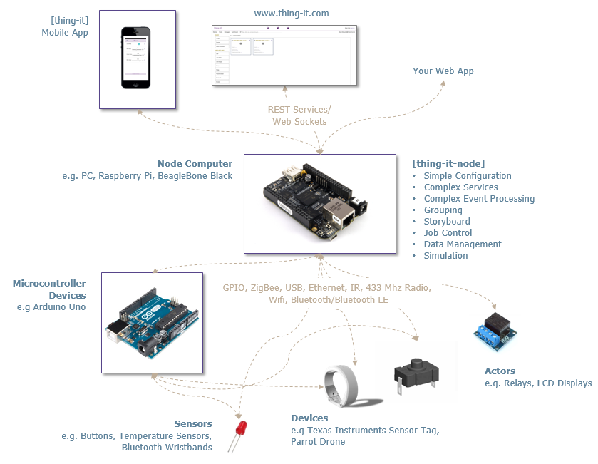

[](https://nodei.co/npm/thing-it-node/)
[](https://nodei.co/npm/thing-it-node/)

**[thing-it-node]** is **a scalable Operating System for Things** and allows you to

* connect multiple Devices (e.g. Heart Rate Monitors, Sensor Tags, Drones) as well as low-level Actors and Sensors managed via Microcontrollers like an Arduino
  to your node computer (e.g. a regular server, a Raspberry Pi or a BeagleBone Black)
* invoke **REST Services** on all Devices and Actors,
* receive **WebSocket Notifications** on all Device and Sensor state changes and events,
* define **Higher-level REST Services** to control multiple Actors,
* define **Complex Event Processing** to react to Sensor events and state changes,
* define **Storyboards** for the timeline-based invocation of Node, Device and Actor Services (e.g. for robotics),
* define **Job Schedules** for a calendar-based, recurring execution of Services including start of Storyboards,
* define **Complex Data Variables** to persistently store Event Data for later evaluation or for configurations
* manage **Users an their Entitlements** to access the above elements and
* use a **Mobile Client** to monitor and control your Devices.

All of the above is controlled by a [nodejs](http://nodejs.org/) server which is bootstrapped from a **simple JSON configuration**, which allows you to
configure a **home automation system in minutes**.

<p align="center"><a href="./documentation/images/architecture.png"></a></p>

More details can be found on the [thing-it-node Wiki](https://github.com/marcgille/thing-it-node/wiki).

# thing-it.com

You can use [www.thing-it.com](http://www.thing-it.com) to create and simulate your setup for **[thing-it-node]** and then just download the configuration file or
connect your Nodes permanently.

# Dual License

**[thing-it-node]** is available under the [MIT License](./thing-it-node/license.mit) and the [Eclipse Public License](https://eclipse.org/org/documents/epl-v10.html).

# Getting Started

## The Scenario

Let's set up a simple - but not too simple - home automation scenario:

1. Two LEDs representing e.g. two lamps (you could actually immediately replace the LEDs by two relays to switch lamps on and off).
1. A Photocell to detect the ambient light in a room and event processing to switch both LEDs on if the light goes below some threshold for a while (to distinguish sunset from the Photocell being temporarily covered by your curious cat).
1. Two buttons to toggle the state of each lamp.
1. A simple (mobile capable) web application to toggle the state of both lamps individually and together - alternatively to using the buttons - and to display the event under 2.

## Not interested in Arduino Experiments?

If you are not interested in tinkering with Microcontrollers and just intend to e.g.

* control your Sonos Sound System,
* get your Smart Home with Aircable Bluetooth Dimmers and Texas Instruments Sensor Tags to work to control your lighting,
* control your drones,
* control your Art-Net/DMX lighting, fog machines etc.,
* configure a Universal Infrared Remote Control?
* control Philips Hue Light Bulbs,
* ...

Then stop reading. Check what we have on git/npm under

* [thing-it-device-sonos](https://www.npmjs.com/package/thing-it-device-sonos)
* [thing-it-device-aircable](https://www.npmjs.com/package/thing-it-device-aircable)
* [thing-it-device-ar-drone](https://www.npmjs.com/package/thing-it-device-ar-drone)
* [thing-it-device-ti-sensortag](https://www.npmjs.com/package/thing-it-device-sensortag)
* [thing-it-device-ti-art-net](https://www.npmjs.com/package/thing-it-device-art-net)
* [thing-it-device-itach](https://www.npmjs.com/package/thing-it-device-itach)
* [thing-it-device-philips-hue](https://www.npmjs.com/package/thing-it-device-philips-hue)
* and more every day ...

Or check the [thing-it.com Mesh Market](http://www.thing-it.com/thing-it/index.html#/marketPanel).

Or just continue reading ...

## Installing, Configuring and Running [thing-it-node]

To install, configure and run  **[thing-it-node]**, first install **nodejs**
	
* [nodejs](https://nodejs.org/en/download/)
 
on your computer (e.g. your PC or your Raspberry Pi). 

Then install **[thing-it-node]**:

```
npm install -g thing-it-node 
```

which will install **[thing-it-node]** in your global **_/node_modules** directory and makes it available 
via the command line program **tin**.

Now create an arbitrary Installation Directory **_&lt;installDir&gt;** and make it your current working directory, e.g.

```
mkdir ~/thing-it-test
cd ~/thing-it-test
```

Then invoke

```
tin example -f simple-lighting
```

which will create a directory **_&lt;installDir&gt;/configurations** and copy the sample **[thing-it-node]** Node Configuration
**simple-lighting.js** into it from which **[thing-it-node]** can be booted.

If you are interested, have a look at this [Node Configuration File](./thing-it-node/examples/simple-lighting/configuration.json) - the content should be self-explanatory.

Probably the most interesting part is the definition of the Photocell 

```javascript
{
       "id": "photocell1",
       "label": "Photocell 1",
       "type": "photocell",
       "configuration": {
       "pin": "A0",
       "rate": 2000
       }
}
```

and the Event Processing for the same

```javascript
{
            id: "eventProcessor3",
            label: "Event Processor 3",
            observables: ["arduino1.photocell1"],
            trigger: {
                type: "timeInterval",
                content: {
                    interval: 10000,
                    cumulation: "maximum",
                    stateVariable: "luminousIntensity",
                    compareOperator: "<",
                    compareValue: 600
                }
            },
            action: {
                type: "nodeService", "content": {"service": "lightsOff"}
            }
        }
```

Start the **[thing-it-node]** from **_&lt;installDir&gt;_/node_modules** via

```
tin run
```

You will see something like

    Running [thing-it-node] from Default Options.
      
    ---------------------------------------------------------------------------
     Protocol                     : http
     Port                         : 3001
     Node Configurations Directory: /Users/marcgille/git/thing-it-node/configurations
     Simulated                    : true
     Log Level                    : debug
    -----------------------------------------------------------------------------
    
    
    12/1/2015 6:32:01 AM INFO NodeManager ===> Scanning directory [/Users/marcgille/git/thing-it-node/lib/../node_modules] for Device Plugins: 		    Actor [LED1] started.
    ...
    12/1/2015 6:32:01 AM INFO Node[The Node] Event Processors started.
    12/1/2015 6:32:01 AM INFO Node[The Node] Jobs activated.
    12/1/2015 6:32:01 AM INFO Node[The Node] Node [The Node] started.

which means that your **[thing-it-node]** Server found its configuration and has been started properly. It is not doing anything because the option **simulated** is set to **true** in the default options. 
You could already use the **[thing-it-node]** Mobile Client against the simulated configuration (which you definitely would do on a new configuration), but for now we want the real thing.

Stop the **[thing-it-node]** Server with **CTRL-C** to prepare **[thing-it-node]** to talk to a real device - which we still have to set up.

## Setting up Device, Actors and Sensors

To setup your Device you need the following hardware

* an Arduino Uno board (e.g. [http://www.adafruit.com/product/50](http://www.adafruit.com/product/50)),
* two LEDs (e.g. [https://www.sparkfun.com/products/9590](https://www.sparkfun.com/products/9590)),
* a Photocell (e.g. [http://www.adafruit.com/product/161](http://www.adafruit.com/product/161)),
* two buttons (e.g.),
* possibly a breadboard (e.g. [http://www.adafruit.com/product/64](http://www.adafruit.com/product/64)) and 
* possibly some jumper wires (e.g. [http://www.adafruit.com/product/758](http://www.adafruit.com/product/758)).

All of the above is also available with Arduino Starter Kits like

* the [Arduino Starter Kit](http://www.amazon.com/Arduino-Starter-Official-170-page-Projects/dp/B009UKZV0A/ref=sr_1_1?s=electronics&ie=UTF8&qid=1420481357&sr=1-1&keywords=arduino+starter+kit) or 
* the [Sparkfun Inventor's Kit]() or
* the [Fritzing Creator Kit](http://shop.fritzing.org/en/a-136/).

To get the Arduino Uno connected

* download and install the Arduino IDE
* plug in your Arduino or Arduino compatible microcontroller via USB,
* open the Arduino IDE, select: *File &raquo; Examples &raquo; Firmata &raquo; StandardFirmata*,
* click *Upload*.

If the upload was successful, the board is now prepared. Now,

* connect your Arduino Board via USB,
* connect the LEDs to Pin 12 and 13.
* connect the Buttons to Pin 2 and 4.
* connect the Photocell to Pin A0.

e.g. like


Restart the **thing-it-node** server with

```
tin run --no-simulate
```

The output should now look like 

    Running [thing-it-node] from Default Options.
      
    ---------------------------------------------------------------------------
     Protocol                     : http
     Port                         : 3001
     Node Configurations Directory: /Users/marcgille/git/thing-it-node/configurations
     Simulated                    : false
     Log Level                    : debug
    -----------------------------------------------------------------------------
    
    
    12/1/2015 6:32:01 AM INFO NodeManager ===> Scanning directory [/Users/marcgille/git/thing-it-node/lib/../node_modules] for Device Plugins: 		    Actor [LED1] started.
    ...
    12/1/2015 6:32:01 AM INFO Node[The Node] Event Processors started.
    12/1/2015 6:32:01 AM INFO Node[The Node] Jobs activated.
    12/1/2015 6:32:01 AM INFO Node[The Node] Node [The Node] started.

You should also be able switch both LEDs on and off via the respective buttons or switch both LEDs on by covering the Photocell for more than a few seconds.

## Running the Mobile Web App

Connect your browser to 

`http://localhost:3001/mobile/index.html`

From a mobile device, replace **localhost** by the IP address of the computer running [thing-it] Node The browser content should look like

<p align="center"><a href="./documentation/images/mobile-client.png"></a></p>

Note, that instead of the browser-based UI - mobile or on your computer - you will soon be able to alternatively use the native app we are preparing.

## Summary

Let us recap what we did:

With

* a simple configuration file,
* the corresponding wiring of the Arduino 

but **no programming** we were able to create a simple but realistic home automation scenario.

## Using thing-it.com

If you still find the creation of the configuration file too technical (we agree ...) - you may consider to use the free services of [www.thing-it.com](http://www.thing-it.com) to create and simulate your setup and then just download the configuration file.

The Simple Lighting solution presented here is available as a Mesh under

[http://www.thing-it.com/thing-it/index.html?offer=54d417205a538cc81b0d31c9#/meshOfferPanel](http://www.thing-it.com/thing-it/index.html?offer=54d417205a538cc81b0d31c9#/meshOfferPanel)

You can find other Meshes in the [thing-it] [Mesh Market](http://www.thing-it.com/thing-it/index.html#/searchPanel) for free simulation and download.

To create your own solutions on [www.thing-it.com](http://www.thing-it.com) you would define **Nodes** and **Devices**


put **Actors**, **Sensors**, **Services** and **Event Processors** together,


edit the logic of **Event Processors**


and **Services** and then simulate and test the configuration before you download it to your **[thing-it-node]** deployment.

Consider the [[thing-it] Documentation](http://www.thing-it.com/thing-it/index.html#/documentationPanel) to configure the scenario described above.

# Taking it further

If you have the **Getting Started** example running, you may want to

* understand the concepts of *[thing-it-node]* better
* have a look at further examples e.g.
    * [Color Changes for an RGB LED with Potentiometers](https://github.com/marcgille/thing-it-node/wiki/RGB-LED-Example)
    * [Animation of RGB LED Color Changes using a Storyboard](https://github.com/marcgille/thing-it-node/wiki/RGB-LED-Color-Changing-Storyboard)
    * [Recurring Service Execution with Jobs](https://github.com/marcgille/thing-it-node/wiki/Recurring-Service-Execution-with-Jobs)
* [connect your [thing-it-node] to the Internet](https://github.com/marcgille/thing-it-node/wiki/Connecting-%5Bthing-it-node%5D-to-the-Internet)
* [apply security measures for your [thing-it-node]](https://github.com/marcgille/thing-it-node/wiki/Using-Signature-and-Encryption-for-REST-Services-and-Web-Socket-Messages)
