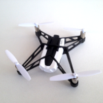

# thing-it-device-ar-drone

[thing-it-node] Device Plugin for [Parrot AR Drone 2.0](http://ardrone2.parrot.com/) products.

This allows you to 

* control AR Drones devices over the Internet,
* define complex services, event processing, storyboards and Jobs combining (possibly multiple) AR Drones devices with other Devices, Sensors and Actors. 

by means of [thing-it-node](https://github.com/marcgille/thing-it-node) and [thing-it.com](http://www.thing-it.com).

## Installation

After you have 

* [set up](http://www.thing-it.com/thing-it/index.html?document=gettingStarted#/documentationPanel) your [thing-it] Node Box and 
* configured or copied a [thing-it] Mesh with an AR Drone, 

no further configuration is required.

## User Interface

