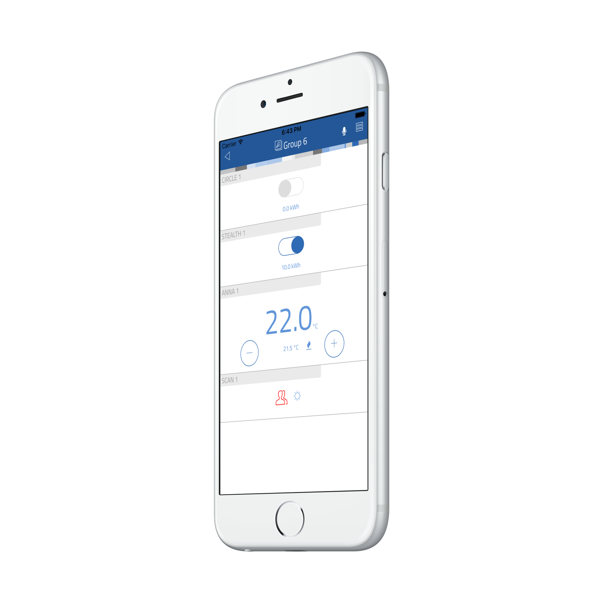

# thing-it-device-plugwise

[thing-it-node] Device Plugins for the Plugwise (http://www.plugwise.com/) products

* Circle (pluggable Energy Meter and Switch)
* Stealth (built-in Energy Meter and Switch)
* Scan (Motion Sensor and Light Detector)
* Sense (Humidity and Temperature Sensor)
* Anna (Smart Thermostat)
* Coolding (Air Conditioner Controller)

# Installation and Configuration

# User Interface

