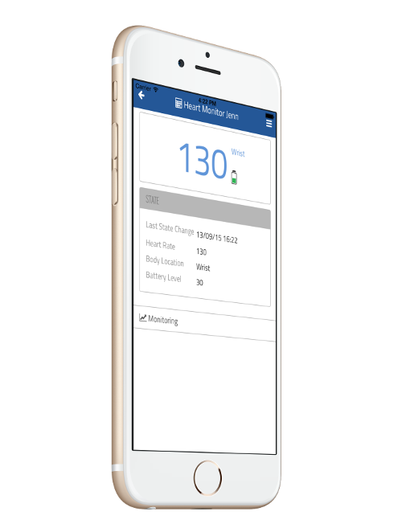
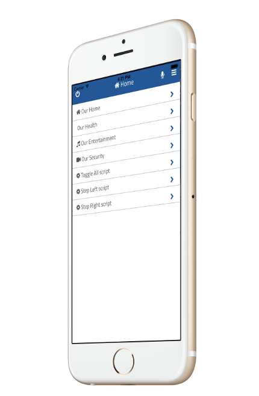
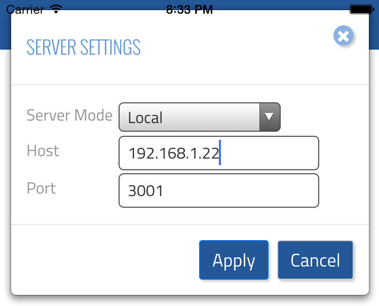

# thing-it-mobile

[thing-it-mobile] is a Mobile Client for [thing-it-node](https://github.com/marcgille/thing-it-node). It allows you to

* control your Devices and Actors,
* Monitor your Sensors and
* invoke complex Services

from your Phone or Pad.

<table>
    <tr>
        <td>
            
        </td>
        <td>
            
        </td>
    </tr>
</table>

*The resulting iOS and Android Apps Will be on Apple App Store and Google Play soon.*

In the meantime you can build and install yourself as described below.

# License

The source code is provided under MIT and EPL license.

## Use of Streamline Fonts

The codebase and distribution of [thing-it] Mobile contains a distribution of the [Streamline Icon Font](http://www.streamlineicons.com/). 
This font is not provided under the MIT or EPL license. Use of the Streamline Icon Font or any subset 
of it for other purposes than development and runtime of and by others than developers and end users of [thing-it] Mobile 
requires a separate license agreement with [http://www.webalys.com](http://www.webalys.com/). 

# Local Installation

## Prerequisites

Install *phonegap*

```
sudo npm install -g phonegap
```

## Build

Clone this repository via

```
git clone https://github.com/marcgille/thing-it-mobile.git
```

in a directory <rootDir> of your choice.

Change to <rootDir>/thing-it-mobile

```
cd thing-it-mobile
```

and build for and run your target mobile platform, e.g.

```
phonegap run ios
```

which should open the XCode Simulator. If it does not, you can open manually **platforms/ios/[thing-it] Mobile.xcodeproj** from XCode.

Alternatively for Android

```
phonegap run android
```

## Run the App

Run the App on your mobile device. Login with your thing-it.com account and access your Meshes from the Mesh screen.

If you want to connect the app with a local [thing-it] Node Box, select **Settings** on the **Sidebar Menu** and switch the **Server Mode** to **local** (providing host IP or DNS name and port)
to talk to a **[thing-it] Node** runtime on your computer.

 
